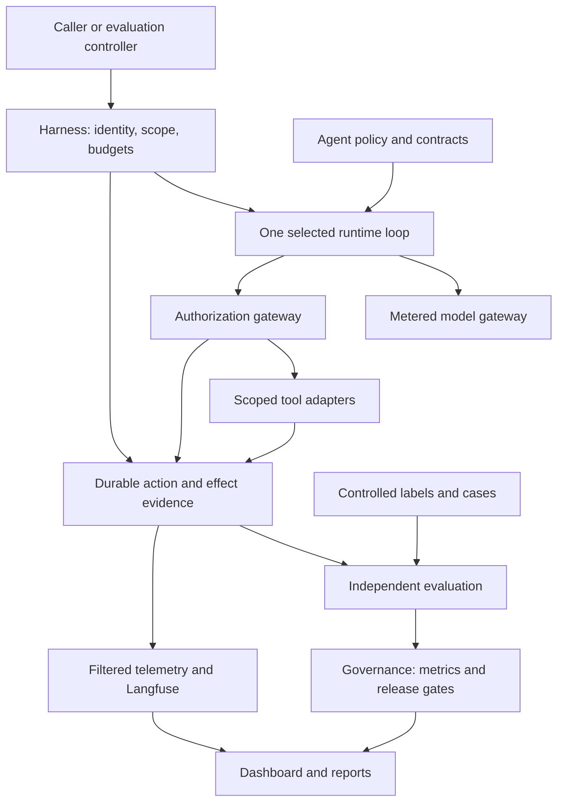

# Architecture and trust boundaries

Version 1.0. Task 00 contracts and ingress validation are implemented. Agent
execution and all runtime integrations below remain planned.

## Loop ownership

The harness owns policy and run supervision. `runtime_adapters/` provides one
loop implementation selected by recipe: a deterministic mock first, then a
proposed OpenAI Agents SDK implementation. The SDK adapter translates the pure
agent policy into its configuration and registers only gateway-backed callbacks.
It must route model calls through the metered model boundary. The original
`AgentPort.build_request/propose` signatures are draft interfaces for the manual
mock path; runtime_ports.RuntimePort defines the selected-loop adapter without forcing a
second loop around the SDK. No SDK integration is claimed by these interfaces.

Concrete wiring lives only in `apps/`. Runtime adapters receive policy and gateway
ports; they do not import hidden graders or instantiate privileged clients.
Model and tool adapters cannot independently expand the action catalog.

## Process isolation

| Trust zone | May access | Must not access |
|---|---|---|
| Agent-facing runtime | Current authorized input, permitted observations, scoped tool descriptors | Oracles, release signing/approval authority, application database credentials |
| Trusted control plane | Identity, policy, action ledger, scoped adapter credentials | Unnecessary held-out labels |
| Evaluation plane | Trial corpus, independent labels, retained trial evidence | Authority to alter the candidate's observed actions retroactively |
| Governance plane | Verified result references, findings, approvals | Ability to rewrite original run evidence |
| Reporting plane | Authorized metric snapshots and safe trace links | Unrestricted writes to gate/approval records |

Packages and import checks are organizational constraints, not security controls.
Enforce these zones with separate identities, service boundaries, mounts, and
network permissions during integration. Reference labels can exist in public
development files but must not be mounted into the runtime during a trial.

## Storage ownership

| Store | Authority and purpose |
|---|---|
| Local run artifact directory | First synthetic milestone: finalized results and integrity manifests |
| Application PostgreSQL | Planned durable sessions, action intents/receipts, approval state, outbox |
| Evidence object store | Controlled immutable/versioned run evidence, manifests, report snapshots |
| Program records | Initial Git JSON/CSV; optional GitHub Projects work tracking with exports |
| Langfuse platform stores | Observability projections and platform metadata, separate from application state |
| Reporting views | Rebuildable read models derived from authoritative snapshots |

Do not query or write Langfuse's private database schema as the integration
contract. Prefer its supported API/export interfaces and a project-owned reporting
schema. Self-hosted platform components and versions are recorded in ADRs 006–009.

The system does not promise distributed exactly-once delivery. It requires
idempotent ingestion, explicit attempts, transactional local state, and external
effect reconciliation where needed.

## V1 learning plane
The independent evaluation plane also owns human review, taxonomy, calibration,
experiments and monitoring analysis. It consumes operational evidence through
ports and writes evaluator-private records. Governance receives authorized
summaries and owns alert triage/findings; apps/ wires scheduling and integrations.
Runtime and optimizer identities cannot read qualification feedback. This adds
no new runtime loop, vendor dependency, or autonomous promotion mechanism.
